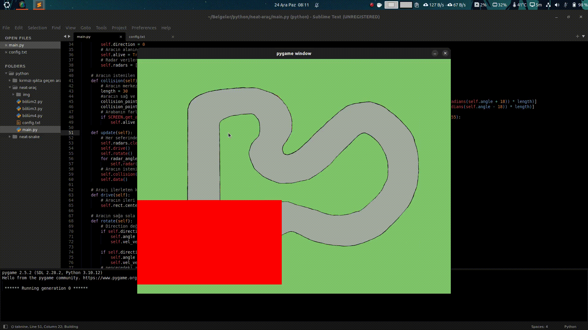

# 🚗 NEAT-Car

🇹🇷: Bu projede, yapay zeka aracı nasıl süreceğini sıfırdan öğrenir. Başta rastgele hareket ederken, her nesilde yol dışına çıkmadan daha uzun mesafe gitmeyi öğrenir.

🇬🇧: In this project, the AI learns how to drive from scratch. It starts by moving randomly and gradually learns to drive longer distances without veering off the track.

---

